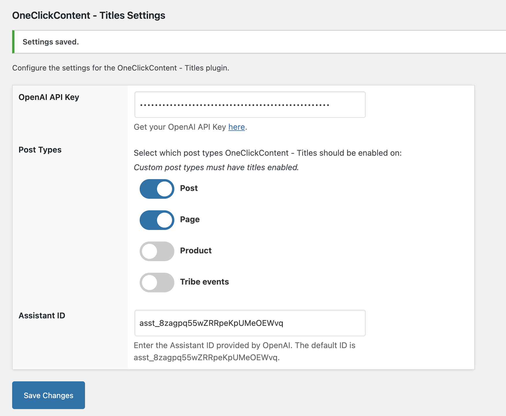
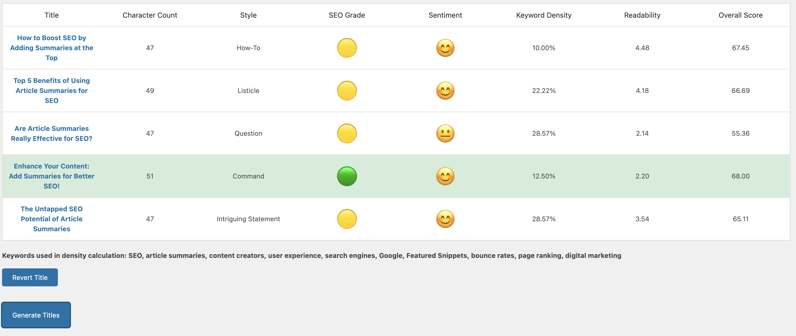

# OneClickContent - Titles Plugin

OneClickContent - Titles is a WordPress plugin that leverages OpenAI to generate SEO-optimized titles for your posts. It provides an interactive interface to create, evaluate, and select titles based on various SEO metrics, readability, keyword density, and sentiment analysis. This is a BYOK (Bring Your Own Key) plugin, meaning you will need to provide your own OpenAI API key.

## Features

- Generate five SEO-optimized titles for any given content.
- Analyze and display the character count for each title.
- SEO grading based on character count.
- Sentiment analysis with corresponding emoji representation.
- Keyword density calculation.
- Readability score calculation.
- Overall score calculation to highlight the best title.
- Revert to the original title with a single click.
- Loading spinner and feedback to enhance user experience.

## Installation

1. **Download the Plugin:**
   - Download the plugin files from oneclickcontent.com or github.

2. **Upload to WordPress:**
   - Go to the WordPress admin dashboard.
   - Navigate to Plugins > Add New > Upload Plugin.
   - Choose the downloaded ZIP file and click "Install Now".

3. **Activate the Plugin:**
   - After installation, click "Activate" to start using the plugin.

4. **Provide OpenAI API Key:**
   - Navigate to the plugin settings page under Settings > OneClickContent - Titles.
   - Enter your OpenAI API key to enable title generation.

## Usage

1. **Generate Titles:**
   - Navigate to any post or page edit screen.
   - Click the "Generate Titles" button to create five SEO-optimized titles.
   - The plugin will display the titles in a table with various metrics like character count, SEO grade, sentiment, keyword density, readability, and overall score.

2. **Select a Title:**
   - Click on any generated title to set it as the post title.
   - The selected title will be highlighted in bold.

3. **Revert to Original Title:**
   - Click the "Revert" button to revert to the original title.

## Screenshots

1. **OCC Titles Settings:**
   

2. **Title Generation:**
   

## Changelog

### 1.0.0
- Initial release with title generation and evaluation features.

## Credits

- Developed by [James Wilson](https://oneclickcontent.com).
- Uses [OpenAI](https://openai.com) for title generation.

## License

This plugin is licensed under the GPL v2 or later.

## GitHub Repository

For more information, updates, and support, please visit the [GitHub repository](https://github.com/jwilson529/OneClickContentTitles).
